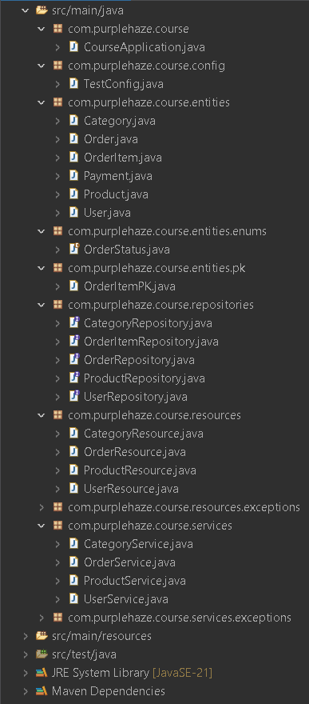
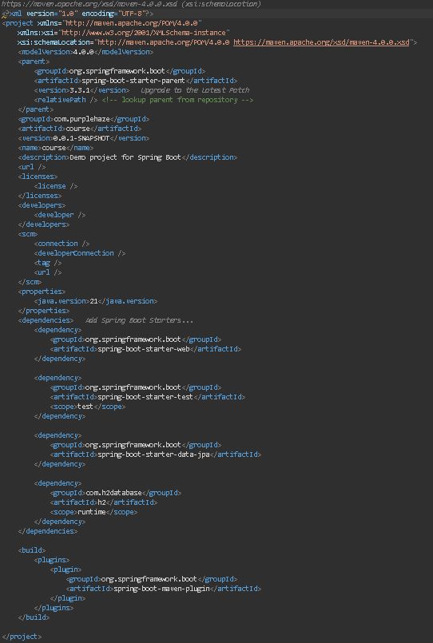
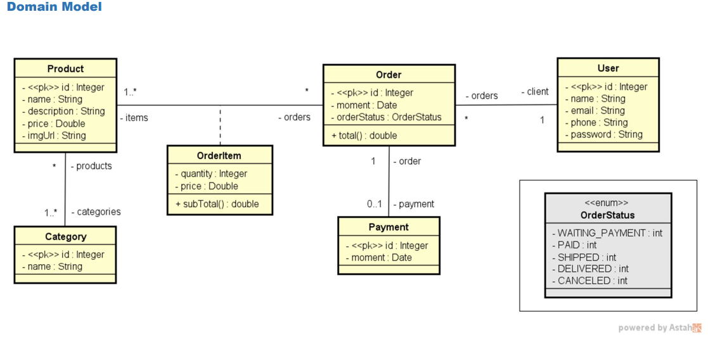

# Sistema de Gerenciamento de Pedidos 
[](https://github.com/filiiipe/workshop-springboot-jpa/blob/main/LICENSE) 

# Sobre o projeto

Este projeto é uma aplicação Java orientada a objetos que utiliza JPA (Java Persistence API) para acesso e gerenciamento de dados, seguindo uma arquitetura em camadas. Ele foi desenvolvido para demonstrar o uso de entidades, repositórios, serviços e controladores REST em um ambiente Spring Boot.

A aplicação permite gerenciar entidades de negócio, como pedidos e produtos, e realiza operações CRUD (Criar, Ler, Atualizar, Deletar) através de uma API RESTful. Além disso, o projeto faz uso de perfis de teste para garantir a integridade e qualidade do código durante o desenvolvimento.

## Estrutura do Projeto


## Configurações de Build e Dependências

Veja abaixo as principais configurações de build e dependências do projeto:



## Modelo conceitual


## Tecnologias Utilizadas

- **Java:** Linguagem de programação principal utilizada para o desenvolvimento da aplicação.
- **Spring Boot:** Framework para configuração automática e desenvolvimento simplificado de aplicações Java.
- **JPA (Java Persistence API):** API para gerenciamento de dados em bancos relacionais.
- **Hibernate:** Implementação da JPA que fornece funcionalidades avançadas de persistência.
- **Maven:** Ferramenta para gerenciamento de dependências e construção do projeto.
- **H2 Database (opcional):** Banco de dados em memória usado para testes e desenvolvimento.
- **Postman:** Utilizado para testar e documentar os endpoints da API.


## Como Executar o Projeto

### Pré-requisitos

- **Java JDK 11 ou superior**
- **Maven**

-  **Clone o Repositório**

   ```bash
   git clone https://github.com/filiiipe/workshop-springboot-jpa.git
   cd workshop-springboot-jpa

# instalar dependências
mvn install

# executar o projeto
mvn spring-boot:run

# Autor

Luiz Filipe Santos Araujo

https://www.linkedin.com/in/luiz-filipe-3068692ba/

